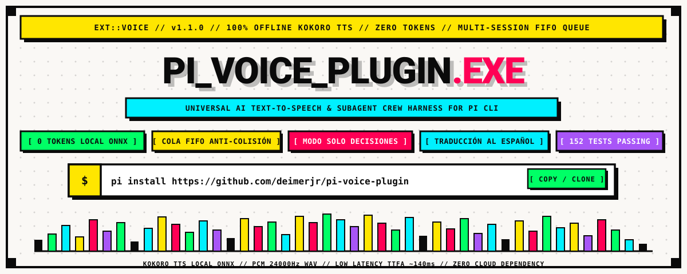
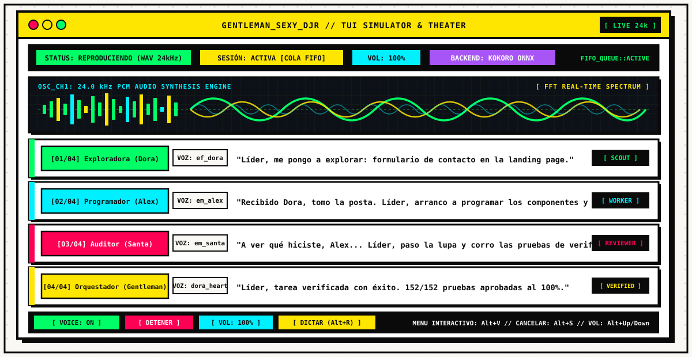
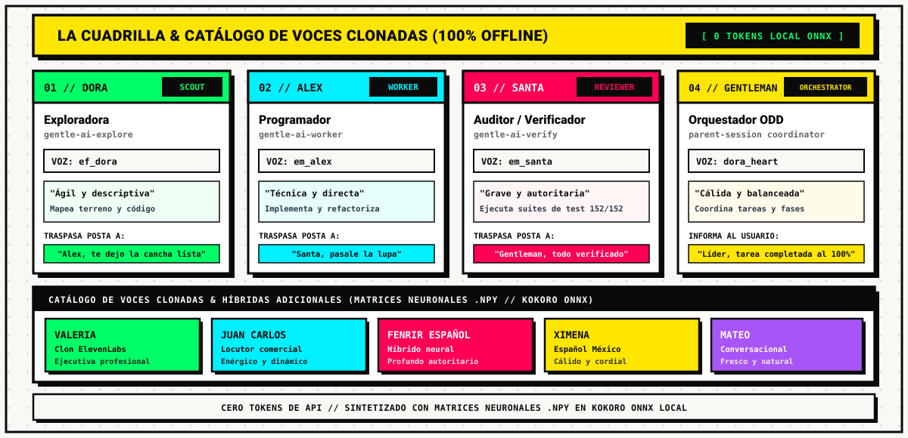
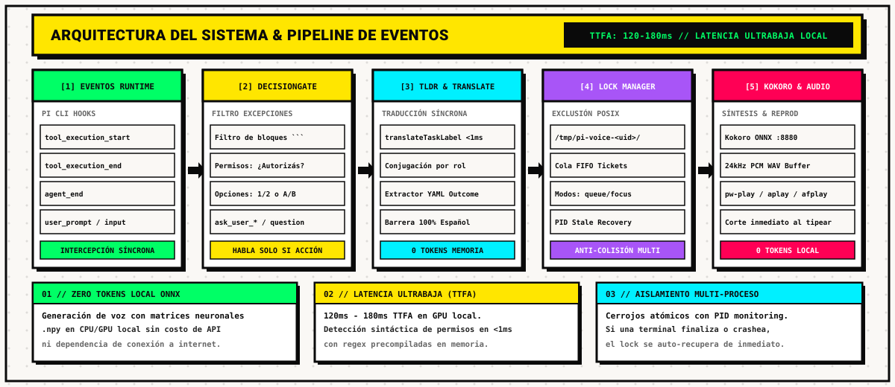
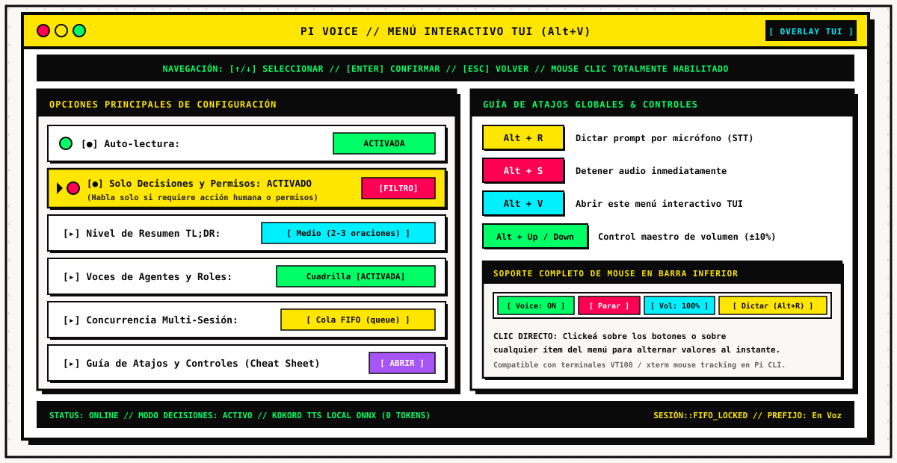

# PI_VOICE_PLUGIN.EXE // UNIVERSAL TTS FOR PI CLI

<p align="center">
  
</p>

<p align="center">
  <a href="https://deimerjr.github.io/pi-voice-plugin/"><kbd><b>[WEB] SITIO OFICIAL / LANDING PAGE ➔</b></kbd></a> &nbsp;
  <a href="https://deimerjr.github.io/pi-voice-plugin/docs.html"><kbd><b>[DOCS] PORTAL WEB DE DOCUMENTACIÓN ➔</b></kbd></a>
</p>

<p align="center">
  <a href="#qué-es-pi-voice-plugin"><kbd><b>[ QUÉ ES ]</b></kbd></a> &nbsp;
  <a href="#características-principales"><kbd><b>[ CARACTERÍSTICAS ]</b></kbd></a> &nbsp;
  <a href="#terminal-theater--simulación-en-vivo"><kbd><b>[ TERMINAL THEATER ]</b></kbd></a> &nbsp;
  <a href="#modo-cuadrilla--voces-clonadas-100-offline"><kbd><b>[ CUADRILLA ]</b></kbd></a> &nbsp;
  <a href="#modo-solo-decisiones-y-permisos-decisionsonly"><kbd><b>[ DECISIONES &amp; PERMISOS ]</b></kbd></a> &nbsp;
  <a href="#concurrencia-multi-sesión-cola-fifo"><kbd><b>[ CONCURRENCIA ]</b></kbd></a> &nbsp;
  <a href="#menú-visual-tui-y-guía-de-atajos"><kbd><b>[ MENÚ TUI ]</b></kbd></a> &nbsp;
  <a href="#instalación-rápida--comandos-cli"><kbd><b>[ COMANDOS ]</b></kbd></a> &nbsp;
  <a href="#suite-de-documentación-técnica-detallada"><kbd><b>[ DOCUMENTACIÓN ]</b></kbd></a> &nbsp;
  <a href="#pruebas-automatizadas-152152-pass"><kbd><b>[ 152/152 TESTS ]</b></kbd></a>
</p>

<p align="center">
  <code>VERSION: 1.1.0</code> &bull;
  <code>ENGINE: KOKORO ONNX (LOCAL)</code> &bull;
  <code>TOKENS: 0 (ZERO COST)</code> &bull;
  <code>SUITE: 152/152 TESTS PASSING</code> &bull;
  <code>LICENSE: MIT</code>
</p>

---

## ¿Qué es Pi Voice Plugin?

> **PI_VOICE_PLUGIN** es una extensión de ingeniería modular para **Pi CLI** que dota al asistente de síntesis y dictado de voz de alta fidelidad, coordinación multi-agente en español nativo y control de concurrencia inter-proceso sin colisiones sonoras.

Funciona de forma **100% offline y gratuita** utilizando **Kokoro TTS** montado localmente en ONNX Runtime (muestreo PCM WAV a 24kHz), garantizando cero consumo de tokens de API y una latencia ultrabaja (TTFA de 120ms a 180ms). Además, soporta de forma transparente proveedores en la nube como OpenAI y ElevenLabs o cualquier endpoint HTTP custom.

```
+---------------------------------------------------------------------------------------------------+
|  [01] RUNTIME HOOKS  -->  [02] DECISION GATE  -->  [03] TLDR TRANSLATE  -->  [04] FIFO LOCK MANAGER|
|  tool & agent events       solo preguntas/permiso   español síncrono <1ms     POSIX /tmp/ anti-clash|
+---------------------------------------------------------------------------------------------------+
                                                                                     |
                                                                                     v
                                                                        [05] KOKORO TTS LOCAL ONNX
                                                                        24kHz WAV // 0 TOKENS API
```

---

## Características Principales

### [01] Menú Visual Interactivo con Soporte de Mouse
- Widget inferior interactivo `[ Voice: ON ] [ Detener ] [ Vol: 100% ] [ Dictar ]` clickeable directamente con el ratón.
- Interfaz gráfica por superposición (TUI Overlay) con navegación mixta por teclado (`↑`, `↓`, `Enter`, `Esc`) y mouse tracking VT100.
- Acceso global mediante el atajo `Alt + V` o el comando `/voice menu`.

### [02] Modo Solo Decisiones y Permisos (`decisionsOnly`)
- Filtro inteligente de excepciones: silencia el flujo de fondo, las ejecuciones autónomas de subagentes y los resúmenes puramente informativos.
- **Vocaliza únicamente ante requerimientos de acción humana**:
  - **Opciones a elegir**: Preguntas con alternativas múltiples (`1. ... 2. ...` o `A) ... B) ...`) o disyunciones binarias (*"¿Prefiere X o Y?"*).
  - **Solicitud de permisos o autorizaciones**: Confirmaciones críticas (*"¿Autoriza la ejecución de...?"*, *"¿Desea aplicar los cambios?"*).
  - **Herramientas interactivas**: Intercepta de inmediato tools como `question`, `ask_user_choice`, `ask_user_question` o `ask_user_confirmation`.
- **Inmunidad a código**: Desparasita bloques markdown (```ts ... ```) para evitar falsos positivos en comentarios o firmas de funciones.

### [03] Traducción Integral al Español para Subagentes
- Los subagentes de la cuadrilla (**Dora**, **Alex**, **Santa**) y el orquestador (**el Gentleman**) **nunca leen instrucciones técnicas en inglés**, aun cuando el harness delegue prompts en inglés.
- **Traductor síncrono instantáneo (`translateTaskLabel`)**: Convierte verbos de ingeniería al español en menos de 1 ms (*"map landing page contact form"* $\rightarrow$ *"explorar el formulario de contacto en la landing page"*).
- **Conjugación por Rol en Primera Persona**: Al concluir, el reporte se formula según la personalidad del agente (*"Implementé los componentes..."*, *"Exploré la estructura..."*, *"Verifiqué las pruebas..."*).
- **Barrera de seguridad garantizada**: Bloquea cualquier residuo en inglés antes de enviarlo al sintetizador y emite una confirmación garantizada en español.

### [04] Consumo de Tokens de IA: 100% Offline y Cero Costo con Kokoro Local
- **Generación de Voz (Kokoro Local)**: 0 tokens (ejecución en CPU/GPU local vía ONNX).
- **Detección de Decisiones y Permisos**: 0 tokens (análisis léxico y sintáctico local precompilado).
- **Traducción de Tareas e Instrucciones**: 0 tokens (diccionario síncrono en memoria).
- **Coordinación Multi-Sesión y Cerrojos FIFO**: 0 tokens (POSIX inter-process en Node.js).
- *(El uso de tokens es estrictamente opcional si se selecciona OpenAI/ElevenLabs en la nube o dictado Whisper).*

### [05] Concurrencia Multi-Sesión con Cola FIFO Anti-Colisión
- Permite abrir múltiples terminales simultáneas de Pi CLI sin interferencias de audio:
  - **Cola FIFO (`queue` - Predeterminado)**: Exclusión mutua atómica en `/tmp/pi-voice-<uid>/` con tickets lexicográficos temporales. Las sesiones hablan ordenadamente una tras otra.
  - **Interrupción (`interrupt` - Takeover)**: La terminal activa detiene de inmediato el audio de sesiones previas y toma el canal.
  - **Modo Foco (`focus`)**: Solo habla la ventana en la que el usuario escribe o interactúa.
  - **Desactivada (`off`)**: Sin coordinación inter-proceso.

### [06] Modo Cuadrilla Dinámica y Voces Diferenciadas por Rol
- Personalidad de equipo con traspaso de tareas y apelativo configurable (**"Líder"**, **"Jefe"**, **"Comandante"**, **"Sensei"**):
  - **Dora (Exploradora / Scout)**: `ef_dora` - *"Líder, me pongo a explorar..."* $\rightarrow$ *"Alex, te dejo la cancha lista."*
  - **Alex (Programador / Worker)**: `em_alex` - *"Recibido Dora, tomo la posta..."* $\rightarrow$ *"Santa, pase la lupa y verifique."*
  - **Santa (Auditor / Reviewer)**: `em_santa` - *"A ver qué hizo Alex... Verifico las pruebas..."* $\rightarrow$ *"Gentleman, todo aprobado."*
  - **el Gentleman (Orquestador ODD)**: `dora_heart` - Reporte ejecutivo con validación completa y cierre de fases.

### [07] Anuncio Contextual de Proyecto y Control de Pruebas
- **Prefijo de proyecto (`announceProject`)**: Antepone `"En <proyecto>:"` (ej: *"En Voz: Alex inicia la tarea..."*) para identificar al instante qué ventana está hablando.
- **Locución de pruebas unitarias (`/voice tests`)**: Anuncia el inicio y resultado de suites de test (`npm test`, `pytest`, `cargo test`), suprimiendo avisos duplicados cuando un auditor ya está activo.

### [08] Dictado Directo por Micrófono (STT) y Control de Volumen
- **Dictado rápido (`Alt + R`)**: Graba el micrófono mediante `pw-record`/`arecord`, transcribe con Whisper e inserta el texto directamente en el prompt.
- **Detención instantánea (`Alt + S`)**: Detiene de inmediato la locución activa.
- **Control maestro de volumen (`Alt + Up` / `Alt + Down`)**: Ajuste rápido en pasos de 10% (0% a 150%).

---

## Terminal Theater & Simulación en Vivo

<p align="center">
  
</p>

El **Terminal Theater** reproduce visualmente el ciclo de vida de ejecución del harness con el tema oficial `Gentleman-Sexy-Djr`:
1. **Monitor HUD**: Muestra en tiempo real el estado de reproducción (`WAV 24kHz`), la política de concurrencia (`COLA FIFO`) y el volumen actual.
2. **Osciloscopio Vectorial en Tiempo Real**: Simulación gráfica de espectro FFT y osciloscopio analógico sincronizado con la emisión de audio.
3. **Pase de Posta de la Cuadrilla**: Visualización estructurada de cómo cada rol toma la palabra de forma ordenada, reportando avances sin pisarse entre sí.
4. **Barra de Control Rápido**: Botones interactivos para alternar la voz, silenciar, ajustar volumen o dictar prompts.

---

## Modo Cuadrilla & Voces Clonadas (100% Offline)

<p align="center">
  
</p>

### Integrantes de la Cuadrilla

| Integrante | Rol Técnico | Subagente Pi | Voz Kokoro | Timbre y Comportamiento |
| :--- | :--- | :--- | :--- | :--- |
| **Dora** | Exploradora / Scout | `gentle-ai-explore` | `ef_dora` | Ágil, clara y descriptiva. Explora archivos y requerimientos. |
| **Alex** | Programador / Worker | `gentle-ai-worker` | `em_alex` | Técnica, enfocada y directa. Escribe código y refactorizaciones. |
| **Santa** | Auditor / Reviewer | `gentle-ai-verify` | `em_santa` | Grave, pausada y autoritaria. Ejecuta suites de prueba (152/152). |
| **el Gentleman** | Orquestador ODD | `parent-session` | `dora_heart` | Cálida, institucional y balanceada. Coordina fases y decisiones. |

### Catálogo de Voces Clonadas e Híbridas (.npy)
Además de las voces estándar de Kokoro, el sistema incluye matrices neuronales `.npy` para clonación offline:
- **VALERIA**: Clon de voz ejecutiva profesional (estilo ElevenLabs).
- **JUAN CARLOS**: Locución comercial enérgica y dinámica.
- **FENRIR ESPAÑOL**: Timbre híbrido profundo, sobrio y autoritario.
- **XIMENA**: Acento español mexicano cálido y conversacional.
- **MATEO**: Registro coloquial joven y fresco.

---

## Modo Solo Decisiones y Permisos (`decisionsOnly`)

El modo **Solo Decisiones y Permisos** es el mecanismo óptimo para desarrolladores que desean trabajar en silencio y ser asistidos por voz únicamente cuando se requiere una intervención humana.

```
                    [ RESPUESTA DEL ASISTENTE ]
                                 |
                                 v
                    [ Desparasitado de Código ]
                     (Remueve ```ts, ```bash, etc.)
                                 |
                                 v
                     ¿Contiene solicitud de permiso,
                     opciones 1/2/A/B o tool interactiva?
                                 |
                    +------------+------------+
                    |                         |
                 [ SÍ ]                    [ NO ]
                    |                         |
                    v                         v
          [ SINTETIZAR AUDIO ]       [ SILENCIO TOTAL ]
          (Interrumpe al usuario     (Desarrollo autónomo
           para pedir decisión)       sin parloteo de fondo)
```

- **Activación rápida**: Comando `/voice decisions on` o desde el menú visual (`Alt + V`).
- **Auto-conexión**: Si la lectura automática estaba desactivada, encender `decisionsOnly` la activa automáticamente bajo este régimen de excepción.

---

## Concurrencia Multi-Sesión (Cola FIFO)

<p align="center">
  
</p>

### Comparativa de Modos de Concurrencia

| Modo | Mecanismo | Comportamiento Sonoro | Caso de Uso Recomendado |
| :--- | :--- | :--- | :--- |
| **`queue`** *(Default)* | Tickets FIFO atómicos en `/tmp/pi-voice-<uid>/` | Cada terminal espera su turno y habla secuencialmente | Desarrollo multi-ventana habitual |
| **`interrupt`** | Exclusión mutua con takeover de proceso | La sesión entrante aborta el audio en curso y habla de inmediato | Tareas prioritarias o alertas urgentes |
| **`focus`** | Seguimiento de foco de terminal activa | Solo vocaliza la terminal donde el usuario escribió recientemente | Trabajo concentrado en una ventana principal |
| **`off`** | Sin cerrojos inter-proceso | Cada proceso emite audio de forma independiente | Pruebas de integración o uso en sesión única |

---

## Menú Visual TUI y Guía de Atajos

<p align="center">
  
</p>

### Atajos de Teclado Globales

| Atajo | Función | Descripción |
| :--- | :--- | :--- |
| **`Alt + R`** | Dictado de Prompt | Inicia o detiene la captura por micrófono e inserta la transcripción en el prompt |
| **`Alt + S`** | Parada Inmediata | Detiene de inmediato la locución activa o cancela la grabación en curso |
| **`Alt + V`** | Menú Interactivo | Abre el menú gráfico TUI con configuración general, voces y atajos |
| **`Alt + Up`** | Subir Volumen | Incrementa el volumen maestro de voz en +10% |
| **`Alt + Down`** | Bajar Volumen | Reduce el volumen maestro de voz en -10% |

### Navegación y Soporte de Mouse
- **Navegación TUI**: Utilice las flechas `↑` y `↓` para seleccionar, `Enter` para ingresar o alternar, y `Esc` para retroceder o salir.
- **Soporte de Ratón**: Haga clic sobre los botones de la barra inferior `[ Voice: ON ]`, `[ Detener ]`, `[ Vol: 100% ]` o sobre cualquier opción del menú para interactuar directamente sin teclado.

---

## Instalación Rápida & Comandos CLI

### Instalación en Pi CLI

```bash
# Instalación permanente vía GitHub
pi install https://github.com/deimerjr/pi-voice-plugin

# O prueba temporal en sesión actual vía Git
pi -e git:github.com/deimerjr/pi-voice-plugin
```

### Tabla Completa de Comandos `/voice`

| Comando | Descripción |
| :--- | :--- |
| `/voice` / `/voice menu` | Abre el menú visual interactivo con navegación por mouse y teclado |
| `/voice record` / `/voice dictar` | Inicia o finaliza la grabación del micrófono para dictado (`Alt + R`) |
| `/voice decisions [on\|off]` | Alterna el modo solo decisiones y permisos (alias: `decisiones`, `permisos`) |
| `/voice crew [on\|off]` | Activa o desactiva la interacción dinámica de la cuadrilla |
| `/voice title <apelativo>` | Configura el título con el que se dirigen los agentes (ej: `Líder`, `Sensei`) |
| `/voice jefe <apelativo>` | Atajo directo para configurar el apelativo del usuario |
| `/voice agents [on\|off]` | Alterna las voces diferenciadas por subagente |
| `/voice phases [on\|off]` | Alterna el anuncio de fases del orquestador en ejecuciones directas |
| `/voice tests [on\|off]` | Alterna el anuncio oral de pruebas unitarias (`npm test`, `pytest`, etc.) |
| `/voice tldr [on\|off\|alto\|medio\|bajo]` | Configura el nivel de síntesis ejecutiva TL;DR |
| `/voice name <rol> <nombre>` | Cambia el nombre de un integrante (`scout`, `worker`, `reviewer`, `orchestrator`) |
| `/voice concurrency <modo>` | Selecciona la política multi-sesión (`queue`, `interrupt`, `focus`, `off`) |
| `/voice project [on\|off]` | Activa el prefijo contextual de proyecto (`"En <proyecto>:"`) |
| `/voice on` / `/voice off` | Activa o desactiva la lectura automática continua |
| `/voice read` | Lee en voz alta la última respuesta generada por el asistente |
| `/voice stop` | Detiene inmediatamente la reproducción de audio |
| `/voice test [frase]` | Emite una frase de prueba a través del sintetizador activo |
| `/voice status` | Muestra el estado del motor, proveedor activo, volumen y reproductor |
| `/voice provider <tipo>` | Cambia de proveedor (`kokoro`, `openai`, `elevenlabs`, `custom`) |
| `/voice voice <id>` | Selecciona la voz activa para el sintetizador |
| `/voice volume <0-150>` | Fija el nivel de volumen de salida |
| `/voice speed <valor>` | Configura la velocidad de locución (ej: `1.0`, `1.25`) |
| `/voice filter <modo>` | Tratamiento de bloques de código: `omit` (ignorar), `mention` (avisar), `raw` (leer) |
| `/voice key <api-key>` | Almacena la clave de API en la configuración local |
| `/voice help` | Despliega la ayuda rápida en la terminal |

### Gestión del Servidor Local Kokoro TTS (Ubuntu systemd)

```bash
kokoro-tts status   # Verifica el estado del servicio y conectividad HTTP
kokoro-tts restart  # Reinicia el demonio local
kokoro-tts stop     # Detiene el servicio
kokoro-tts start    # Inicia el servicio
kokoro-tts test     # Genera y reproduce un audio de prueba a 24kHz
```

---

## Configuración y Variables de Entorno

El archivo de configuración reside en `~/.pi/agent/voice.json`. El orden de resolución para claves de API es:
1. Valores explícitos en `~/.pi/agent/voice.json`.
2. Variables de entorno: `OPENAI_API_KEY` (o `OPENAI_TTS_API_KEY`) y `ELEVENLABS_API_KEY` (o `XI_API_KEY`).

### Ejemplo de Configuración (`~/.pi/agent/voice.json`):

```json
{
  "enabled": true,
  "autoRead": false,
  "decisionsOnly": true,
  "concurrencyMode": "queue",
  "announceProject": true,
  "tldr": true,
  "tldrLevel": "medium",
  "provider": "kokoro",
  "kokoro": {
    "baseUrl": "http://127.0.0.1:8880/v1",
    "voice": "ef_dora",
    "speed": 1.0,
    "format": "wav"
  },
  "subagents": {
    "enabled": true,
    "crewMode": true,
    "announceStart": true,
    "announceEnd": true,
    "announceOrchestratorPhases": true,
    "announceTests": true,
    "orchestrator": "dora_heart",
    "scout": "ef_dora",
    "worker": "em_alex",
    "reviewer": "em_santa",
    "userTitle": "Líder",
    "scoutName": "Dora",
    "workerName": "Alex",
    "reviewerName": "Santa",
    "orchestratorName": "el Gentleman"
  }
}
```

---

## Suite de Documentación Técnica Detallada

Para consultar la especificación exhaustiva de cada subsistema, revise los documentos dedicados:

- **[Sitio Web Oficial y Landing Page (En Vivo)](https://deimerjr.github.io/pi-voice-plugin/)**: Landing page interactiva Neo-Brutalista con Terminal Theater, soundboard de la cuadrilla, osciloscopio y formulario de registro.
- **[Portal Web Interactivo de Documentación (En Vivo)](https://deimerjr.github.io/pi-voice-plugin/docs.html)**: Navegación web con buscador en tiempo real, filtros por categoría y selector de temas (también accesible localmente en [landing/docs.html](landing/docs.html)).
- **[Arquitectura del Sistema y Ciclo de Vida de Eventos](docs/architecture.md)**: Flujo de hooks en runtime Pi CLI (`tool_execution_start`, `tool_execution_end`, `agent_end`), diseño de subsistemas y compuertas de filtrado.
- **[Coordinación Inter-Proceso y Concurrencia Multi-Sesión](docs/concurrency.md)**: Cerrojos atómicos POSIX en `/tmp/pi-voice-<uid>/`, análisis comparativo de modos (`queue`, `interrupt`, `focus`, `off`) y aislamiento de sesiones concurrentes.
- **[Referencia Completa de Configuración y Comandos](docs/configuration.md)**: Estructura del esquema `voice.json`, catálogo de voces, resolución de credenciales y sintaxis de comandos CLI.
- **[Servidor Kokoro Local, Clonación y Operación 100% Offline](docs/kokoro-offline.md)**: Topología ONNX local (8880), servicio systemd `kokoro-tts`, pipeline de matrices neuronales `.npy` y benchmarks de latencia.
- **[Portal Web Interactivo de Documentación](landing/docs.html)**: Navegación web con buscador en tiempo real, filtros por categoría y selector de temas.
- **[Historial de Versiones (Changelog)](CHANGELOG.md)**: Registro histórico de cambios bajo la convención Keep a Changelog.
- **[Guía de Contribución y Desarrollo](CONTRIBUTING.md)**: Pautas de arquitectura, filosofía ODD, estándares de TypeScript sin transpiladores y flujo de trabajo para Pull Requests.

---

## Pruebas Automatizadas (152/152 PASS)

El proyecto cuenta con una batería de **152 pruebas automatizadas** que validan la totalidad de subsistemas, ejecutadas directamente sobre el test runner nativo de Node.js:

```bash
# Ejecutar suite de pruebas TypeScript del plugin (103 tests)
npm test

# Ejecutar suite de pruebas de la landing page y assets (49 tests)
node --test landing/landing.test.js

# Ejecución combinada completa (152 tests)
npm test && node --test landing/landing.test.js
```

### Desglose de Pruebas:
- **`ConfigManager` (9 tests)**: Persistencia, recarga de parámetros, resolución jerárquica de claves y flags `decisionsOnly`/`announceProject`.
- **`DecisionGate` (18 tests)**: Heurísticas de permisos en español e inglés, detección de disyunciones, sanitización de bloques de código y evaluación de herramientas interactivas.
- **`Extension Entrypoint` (19 tests)**: Registro de comandos `/voice`, compuertas de eventos en runtime, anuncios de pruebas con debounce y traspaso dinámico entre agentes.
- **`PlaybackLockManager` (10 tests)**: Concurrencia multi-sesión, cola FIFO con tickets lexicográficos, modo interrupción y modo foco con recuperación de PIDs huérfanos.
- **`VoiceMenuComponent` (11 tests)**: Renderizado de pantallas TUI, navegación de submenús, despacho de eventos de ratón y guía de atajos.
- **`AudioPlayer` & `AudioRecorder` (9 tests)**: Detección de binarios del sistema (`pw-play`, `pw-record`, `aplay`), escalado de muestras WAV y señales de interrupción limpia.
- **`TTS Providers` (6 tests)**: Formateo de payloads para Kokoro ONNX local, OpenAI, ElevenLabs y Custom HTTP.
- **`TextSanitizer` (7 tests)**: Eliminación de sintaxis markdown, tablas, bloques de código y filtrado de etiquetas `<think>`.
- **`TldrSummarizer` (9 tests)**: Traducción síncrona `translateTaskLabel`, conjugación contextual por rol y barrera de seguridad en español.
- **`AudioTranscriber` (3 tests)**: Peticiones multipart a Whisper, detección de silencios y descarte de alucinaciones.
- **`Landing & Web Docs Architecture` (49 tests)**: Semántica HTML5, tokens CSS Neo-Brutalistas, interactividad de Cuadrilla, validación de archivos de audio RIFF/WAVE PCM, motor de Terminal Theater, formulario con Web Audio API y portal de documentación con buscador.

---

## Licencia

Distribuido bajo la licencia **MIT**. Consulte el archivo `LICENSE` para mayores detalles.
